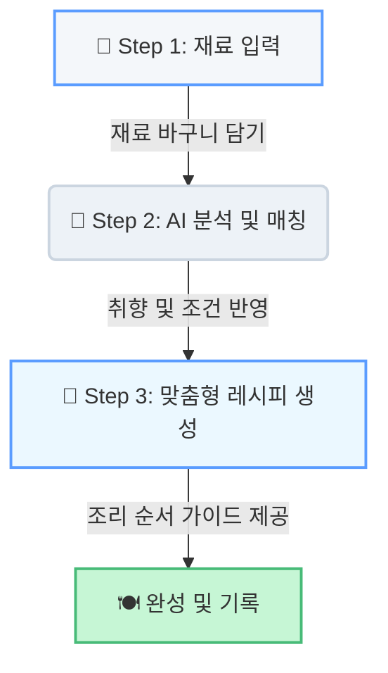
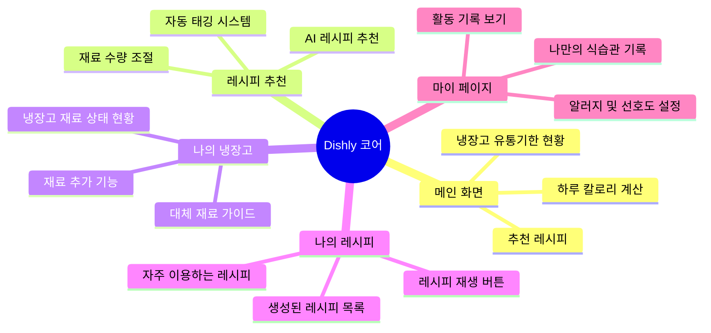

# 🍳 Dishly (디슐리): AI 스마트 레시피 큐레이터

> **"냉장고 속 남은 재료에 새로운 가치를."**
> **사용자의 식재료 데이터를 바탕으로 최적의 조리법을 설계하고 제안하는 지능형 푸드테크 UI 프로젝트입니다.**

---

## 🔗 프로젝트 아카이브

| 구분          | 링크                                                                                                                                                 |
| ------------- | ---------------------------------------------------------------------------------------------------------------------------------------------------- |
| **저장소**    | [GitHub: dishly-ai-recipe](https://github.com/kny45112003-hue/dishly-ai-recipe)                                                                      |
| **기획 문서** | [Notion: 제품 비전 및 UX 전략](https://www.google.com/search?q=https://breezy-split-6d5.notion.site/Product-Vision-32c5661c2d928021ba32d1a5dba2d51a) |

---

## 💎 프로젝트 핵심 가치 (Core Value)

| 가치                     | 설명                                                                    |
| ------------------------ | ----------------------------------------------------------------------- |
| **직관적인 재료 관리**   | 복잡한 입력 대신 카드형 UI를 통해 식재료를 한눈에 파악할 수 있도록 구성 |
| **AI 레시피 워크플로우** | 사용자가 재료를 선택하고 레시피를 제안받는 일련의 과정을 화면으로 구상  |
| **모바일 최적화 UI**     | 주방이라는 특수한 환경을 고려하여 큼직한 버튼과 고대비 레이아웃 적용    |

---

## ⚙️ 서비스 작동 로직 (Service Logic)

Dishly는 **분석 - 생성 - 안내**로 이어지는 3단계 지능형 프로세스로 설계되었습니다.

---

## 🎨 디자인 전략 및 UX 철학

조리 중인 사용자의 환경(주방)을 고려하여 '방해 없는 사용자 경험(Kitchen-Friendly UX)'을 설계했습니다.

### 디자인 시스템 (Design System)

#### 1. Color System

- **메인 컬러**: `#5A9CFF` (상쾌하고 신뢰감을 주는 블루)
- **포인트 컬러**: `#003482` (가독성을 높이는 딥 블루)
- **배경 컬러**: `#F4F7FA` (깨끗한 주방 이미지를 연상시키는 화이트 그레이)

#### 2. Typography

- **Noto Sans / Pretendard**: 각진 서체를 활용하여 단정하고 전문적인 인상을 주며, 모바일 환경에서의 가독성을 극대화했습니다.

---

## 🛠 기술 스택 (Tech Blueprint)

### 개발 환경 (Frontend)

### 디자인 및 협업

---

## 🗺 정보 구조도 (IA)

---

## 🚀 향후 구현 및 발전 계획 (Roadmap)

현재 설계된 프론트엔드 UI를 바탕으로 다음 기능을 단계적으로 통합할 예정입니다.

- **AI 엔진 실제 연동**: OpenAI API를 활용하여 사용자가 선택한 재료 기반의 실시간 레시피 텍스트 생성
- **동적 데이터 바구니**: LocalStorage 또는 데이터베이스를 연동하여 실제 재료 관리 시스템 활성화
- **인터랙티브 가이드**: 조리 단계별 스마트 타이머 및 음성 안내 인터랙션 추가

---

**Dishly**는 단순한 앱을 넘어, 기술을 통해 일상의 요리를 더 쉽고 가치 있게 만드는 '주방의 동반자'를 지향합니다.
