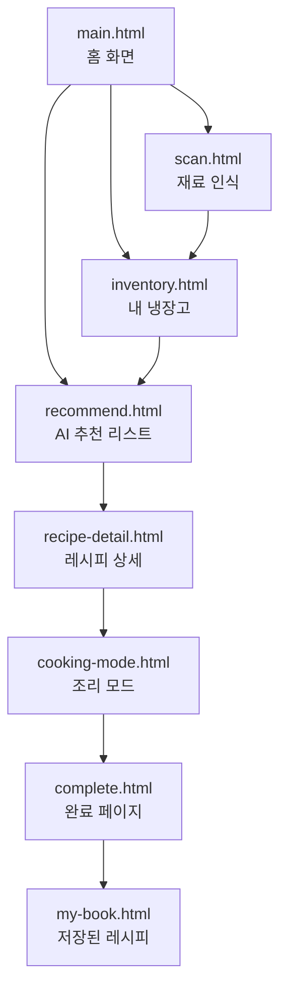
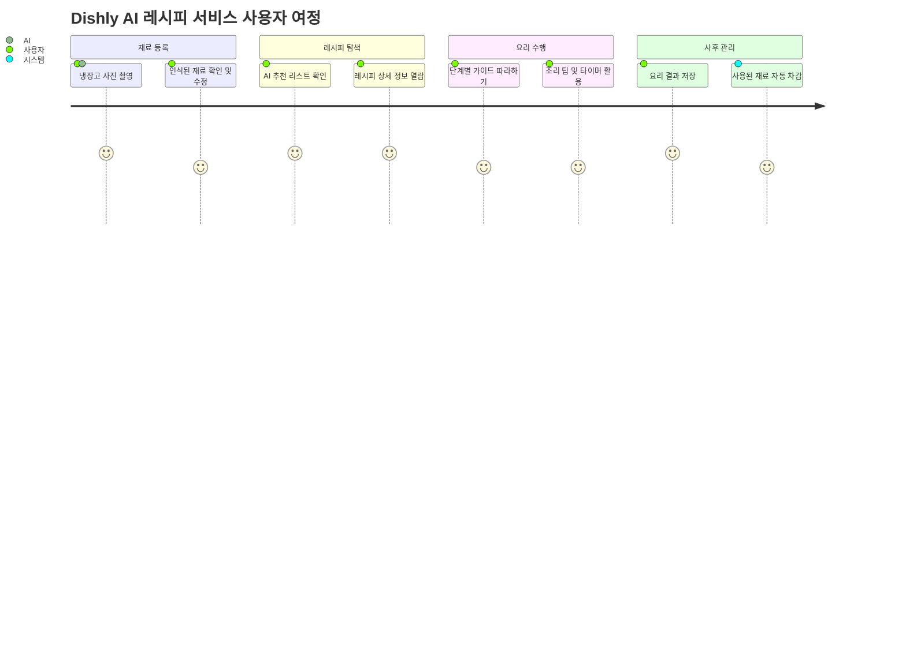
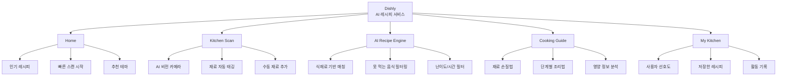

# 🍳 AI 스마트 레시피 추천 서비스 앱

사용자의 냉장고 속 재료를 바탕으로

**최적의 요리법과 영양 정보를 제안하는 AI 기반 레시피 어시스턴트 프로젝트**입니다.

> 사용자는 식재료를 사진으로 찍거나 입력하여, 맞춤형 레시피를 추천받고 상세 조리 가이드를 통해 요리를 완성할 수 있습니다.

---

## 프로젝트 링크

| 구분             | 링크                                                                                                                                                                         |
| ---------------- | ---------------------------------------------------------------------------------------------------------------------------------------------------------------------------- |
| GitHub           | [https://github.com/kny45112003-hue/dishly-ai-recipe](https://github.com/kny45112003-hue/dishly-ai-recipe)                                                                   |
| Notion 기획 문서 | [https://breezy-split-6d5.notion.site/Product-Vision-32c5661c2d998021ba32d1a5dba2d51a](https://breezy-split-6d5.notion.site/Product-Vision-32c5661c2d998021ba32d1a5dba2d51a) |

---

## 프로젝트 개요

| 항목        | 내용                                                      |
| ----------- | --------------------------------------------------------- |
| 프로젝트명  | AI 스마트 레시피 추천 서비스                              |
| 서비스명    | Dishly (디슐리)                                           |
| 유형        | AI 비전 인식 기반 레시피 큐레이션 서비스                  |
| 핵심 기능   | 식재료 비전 인식, AI 맞춤 레시피 생성, 단계별 조리 가이드 |
| 제작 방식   | React, Next.js, TypeScript                                |
| AI 엔진     | GPT-4o, Gemini Pro Vision                                 |
| 데이터 관리 | Supabase 기반 식재료 및 사용자 데이터 관리                |

---

## 핵심 기능

| 기능           | 설명                                          |
| -------------- | --------------------------------------------- |
| 재료 스캔      | 사진 촬영을 통한 AI 식재료 자동 인식          |
| 인벤토리 관리  | 현재 보유 중인 재료 리스트업 및 유통기한 관리 |
| AI 레시피 추천 | 남은 재료 최적 조합 기반 레시피 큐레이션      |
| 조리 모드      | 음성 안내 및 단계별 인터랙티브 가이드 제공    |
| 영양 분석      | 생성된 레시피의 칼로리 및 영양 성분 표시      |
| 저장 기능      | 마음에 드는 레시피 보관 및 나만의 요리책      |

---

## 서비스 흐름

---

## 화면 구조

---

## 사용자 여정

---

## 정보 구조도 (Information Architecture)

---

## 기술 스택

### Frontend & AI

### Tools & Backend

---

## 주요 구현 포인트

| 구분      | 구현 내용                                             |
| --------- | ----------------------------------------------------- |
| 비전 인식 | Gemini Vision API를 연동한 실시간 객체 인식 처리      |
| 프롬프트  | GPT-4o 최적화를 통한 정확한 조리 단계 및 분량 생성    |
| UI 디자인 | 요리 중 가독성을 높이기 위한 고대비 카드형 인터페이스 |
| 상태 관리 | 스캔된 재료를 전역 상태로 관리하여 추천 로직에 전달   |
| 반응형    | 모바일/태블릿 환경에 최적화된 조리 모드 레이아웃      |

---

## 프로젝트에서 신경 쓴 부분

| 관점        | 내용                                                               |
| ----------- | ------------------------------------------------------------------ |
| UX          | 사용자가 재료를 일일이 입력하는 번거로움을 AI 스캔으로 최소화      |
| UI          | 식욕을 돋우는 Warm Tone 컬러와 깔끔한 인포그래픽 중심의 시각화     |
| AI Accuracy | 프롬프트 엔지니어링을 통해 보유 재료와 실제 레시피의 일치율 극대화 |
| Portfolio   | 기획 의도부터 AI 기술 활용 능력을 한눈에 보여주는 서비스 흐름 구성 |

---

## 프로젝트 의의

이 프로젝트는 단순히 기존 레시피를 검색하는 도구를 넘어, **AI 비전 인식 기술**을 실생활(냉장고 관리)에 접목하여 사용자 문제를 직접 해결하는 **문제 해결형 AI 서비스**입니다.

특히 기획 단계에서부터 사용자의 페인 포인트(남은 재료 처리)를 분석하고, 이를 직관적인 UI와 고도화된 AI 엔진으로 풀어내는 전체 프로세스를 경험하는 데 중점을 두었습니다.
