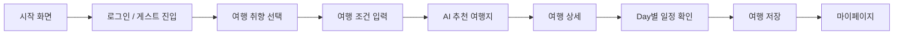
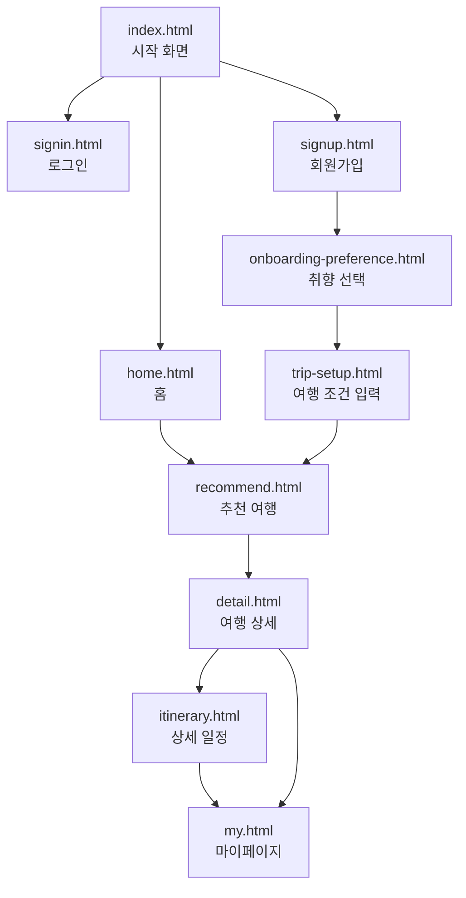
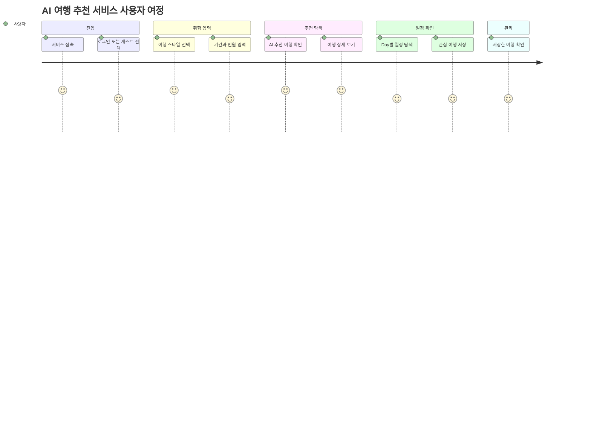
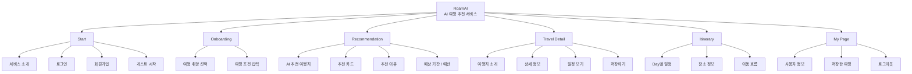
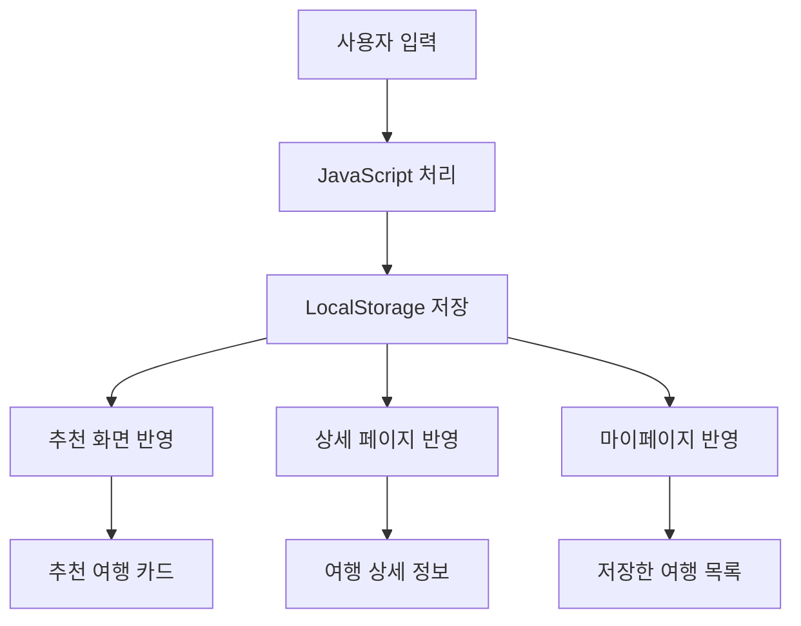
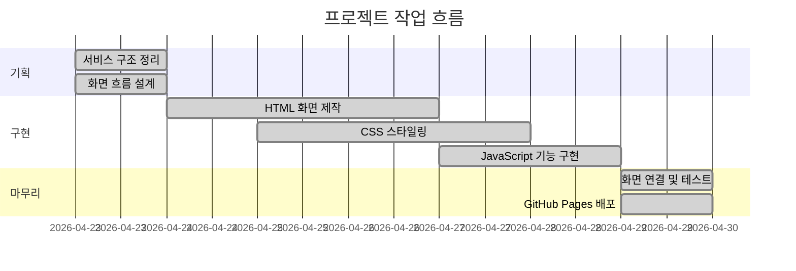
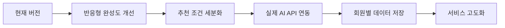

# AI 여행 추천 서비스 앱

사용자의 여행 취향을 바탕으로  
**맞춤 여행지와 일정 흐름을 제안하는 AI 여행 추천 서비스 UI 프로젝트**입니다.

> 사용자는 여행 스타일을 선택하고, 추천 여행지를 확인한 뒤, 상세 일정과 저장 기능을 통해 여행 계획을 탐색할 수 있습니다.

---

## 프로젝트 링크

| 구분             | 링크                                                                         |
| ---------------- | ---------------------------------------------------------------------------- |
| GitHub           | https://github.com/joona0306/ai-travel-service                               |
| 배포 페이지      | https://joona0306.github.io/ai-travel-service/                               |
| Notion 기획 문서 | https://unexpected-sheep-e3c.notion.site/AI-32cd8ef246b780cfa1e0fc78ea48bbb7 |

---

## 프로젝트 개요

| 항목        | 내용                                                   |
| ----------- | ------------------------------------------------------ |
| 프로젝트명  | AI 여행 추천 서비스 앱                                 |
| 서비스명    | RoamAI                                                 |
| 유형        | 반응형 웹 기반 여행 추천 서비스                        |
| 핵심 기능   | 여행 취향 선택, AI 추천 여행지, 상세 일정, 저장한 여행 |
| 제작 방식   | HTML, CSS, JavaScript                                  |
| 데이터 관리 | LocalStorage 기반 상태 저장                            |
| 배포        | GitHub Pages                                           |

---

## 핵심 기능

| 기능           | 설명                                    |
| -------------- | --------------------------------------- |
| 온보딩         | 사용자의 여행 취향 선택                 |
| 여행 조건 입력 | 목적지 분위기, 기간, 인원 입력          |
| AI 추천 결과   | 취향 기반 추천 여행 카드 제공           |
| 여행 상세      | 여행지 소개, 추천 이유, 기간, 예산 확인 |
| 일정 보기      | Day별 세부 여행 일정 확인               |
| 저장 기능      | 관심 여행 저장 및 마이페이지 확인       |
| 로그인 흐름    | 로그인/회원가입 화면 구성               |

---

## 서비스 흐름



---

## 화면 구조



---

## 사용자 여정



---

## 정보 구조도 (Information Architecture)



---

## 추천 데이터 예시

| 여행지          | 콘셉트          | 기간 | 특징                             |
| --------------- | --------------- | ---: | -------------------------------- |
| 일본 도쿄       | 도시와 전통     |  7일 | 도시 탐험과 역사·문화 경험       |
| 인도네시아 우붓 | 힐링과 웰니스   |  5일 | 자연, 스파, 명상 중심 일정       |
| 스위스 알프스   | 자연과 액티비티 |  7일 | 하이킹, 전망열차, 절경 중심 일정 |

---

## 기술 스택

### Frontend


### Tools


---

## 주요 구현 포인트

| 구분      | 구현 내용                                   |
| --------- | ------------------------------------------- |
| 화면 구성 | HTML 페이지 단위로 서비스 흐름 구성         |
| 스타일링  | CSS 기반 반응형 UI 디자인                   |
| 인터랙션  | JavaScript로 버튼, 필터, 저장 기능 처리     |
| 상태 관리 | LocalStorage로 사용자 정보와 저장 여행 관리 |
| 추천 카드 | 여행 데이터 배열 기반 카드 렌더링           |
| 일정 화면 | 선택한 여행지의 Day별 일정 표시             |

---

## 상태 관리 구조



---

## 폴더 구조

```text
ai-travel-service
├── assets
│   ├── icons
│   └── images
├── css
│   └── style.css
├── js
│   └── script.js
├── index.html
├── home.html
├── signin.html
├── signup.html
├── onboarding-preference.html
├── trip-setup.html
├── recommend.html
├── detail.html
├── itinerary.html
├── my.html
└── README.md
```

---

## 페이지별 역할

| 페이지                       | 역할                        |
| ---------------------------- | --------------------------- |
| `index.html`                 | 서비스 진입 화면            |
| `home.html`                  | 여행 검색 및 추천 시작 화면 |
| `signin.html`                | 로그인 화면                 |
| `signup.html`                | 회원가입 화면               |
| `onboarding-preference.html` | 여행 취향 선택 화면         |
| `trip-setup.html`            | 여행 조건 입력 화면         |
| `recommend.html`             | AI 추천 여행 리스트 화면    |
| `detail.html`                | 추천 여행 상세 화면         |
| `itinerary.html`             | Day별 여행 일정 화면        |
| `my.html`                    | 저장한 여행 확인 화면       |

---

## 작업 과정



---

## 프로젝트에서 신경 쓴 부분

| 관점        | 내용                                                    |
| ----------- | ------------------------------------------------------- |
| UX          | 사용자가 추천을 받기까지의 흐름을 단순하게 구성         |
| UI          | 카드, 버튼, 배지, 여행 이미지 중심의 시각적 구성        |
| Web         | 여러 HTML 페이지를 연결한 서비스형 화면 구성            |
| Interaction | 추천 필터, 일정 선택, 저장 기능 등 기본 동작 구현       |
| Portfolio   | 기획 → 화면 → 구현 → 배포 흐름을 보여주는 프로젝트 구성 |

---

## 개선 예정



| 개선 항목   | 방향                                        |
| ----------- | ------------------------------------------- |
| 추천 기능   | 실제 AI API 또는 추천 로직 연동             |
| 데이터 관리 | LocalStorage에서 서버/DB 기반으로 확장      |
| UI 개선     | 모바일 화면 최적화 및 인터랙션 강화         |
| 접근성      | 버튼, 링크, 대체 텍스트, 키보드 접근성 보완 |
| 포트폴리오  | 화면 캡처, 기획 문서, 디자인 시스템 추가    |

---

## 프로젝트 의의

이 프로젝트는 단순한 정적 웹페이지가 아니라,  
**사용자 입력 → 추천 결과 → 상세 일정 → 저장한 여행 관리**로 이어지는  
서비스형 웹 UI 흐름을 구현한 프로젝트입니다.

특히 UI/UX 관점에서는 사용자가 여행 추천을 받는 과정을 단계적으로 설계하고,  
웹디자인 관점에서는 여행 서비스에 어울리는 카드형 UI와 시각적 흐름을 구성하는 데 집중했습니다.

---

## 제작자

| 구분   | 내용                                                     |
| ------ | -------------------------------------------------------- |
| 이름   | joona0306                                                |
| 역할   | UI/UX 설계, 웹디자인, 퍼블리싱, JavaScript 인터랙션 구현 |
| GitHub | https://github.com/joona0306                             |
